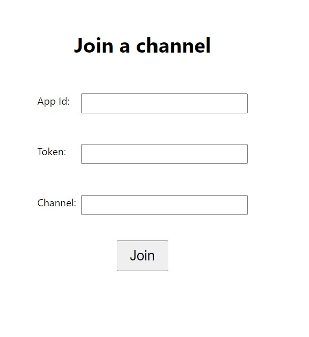
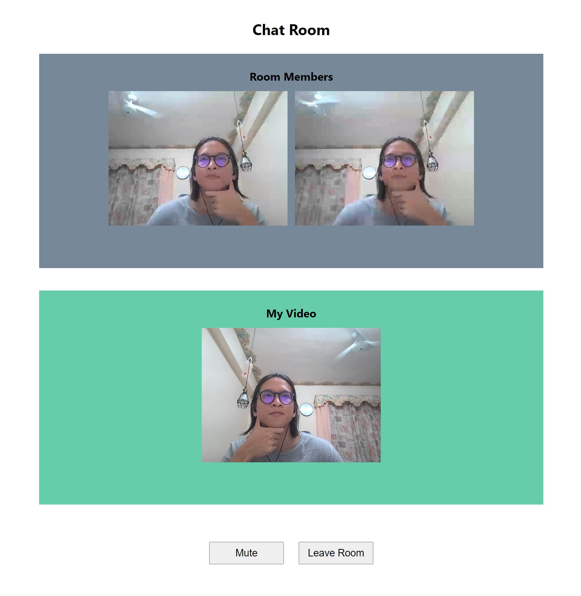
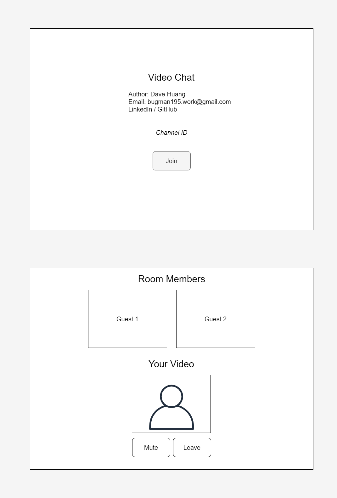

# React Group Video Chat

Author: Dave Huang  
Email: bugman195.work@gmail.com

## Project Spec

### Basics

- [x] Implement all the channel life-cycle hooks of [Agora](https://www.agora.io/en/) SDK
- [x] Implement 1-1 video call feature
- [x] Use of FE framework: React
- [x] Use Promise & async/await to simplify logic

### Advanced

- [x] Support Stream mute/unmute
- [x] Use TypeScript
- [x] Support group video call
- [x] Use of third party UI kit（SCSS in this repo）
- [x] Use of Redux
- [x] Error handling of each event handler
- [ ] Unit test

## How to run

In the project directory, run:

1. `yarn install`

2. `yarn start`

3. Open [http://localhost:3000](http://localhost:3000) to view it in the browser.

4. Enter the **appId**, **temp token** and **channel name** set from Agora.io project console.

## Result Screenshot

### Landing page

### Chat room page

## Project Planning

- Go through document and resources
- Design simple prototype  
  
- Go through all the client init flow
- Establish local stream and show UI
- Handle remote stream event handlings
- Add remote streams' UI
- Handle mute function
- Fine tune CSS
